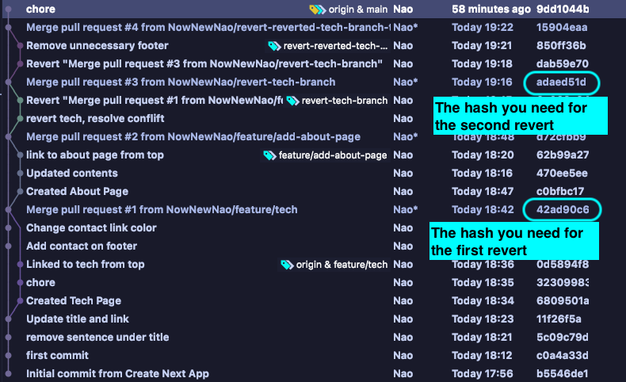

This repository explains how to double revert.
[Deplyment goes here](https://how-to-double-revert.vercel.app/)

## 🌳 Branches

- `main`
- `feature` 
  - `/tech` Accidentally includes footer that should not be there, but pushed and merged in `main`
  - `/about` Add about page. No problem happens here.
- `revert`
  - `/tech-branch` Revert `feature/tech` as the first revert
  - `/reverted-tech-branch-to-restore-necessary-code` Revert `revert/tech-branch` to restore wanted changes and fix unwanted changes which was accidentally pushed into `feature/tech` as the second revert

## ☝️ Commands
```git
git revert {commit_hash}
```

*If you get this error 
error: Commit {commit_hash} is a merge but no -m option was given.

```git
git revert -m 1 {commit_hash}    
OR
git revert -m 2 {commit_hash}
```
* `1` for the 'merged branch' and `2` for the 'merge branch'


# 🚗 How to revert

- Switch to `main`
- Pull the latest `main`
- Create new branch and switch on it  👈`revert/tech-branch`
- Copy Merge commit  👈`42ad90c64d3193ef79722b89e346f5f84675f563`
- Run the command 👈`git revert -m 1 42ad90c64d3193ef79722b89e346f5f84675f563`
- Push and Merge the branch for revert to `main` 👈` revert/tech-branch` 
- Switch to `main`
- Pull the latest `main`
- Create new branch and switch on it 👈 `revert/reverted-tech-branch-to-restore-necessary-code`
- Run the command 👈 `git revert -m 1 adaed51d7b9d5386f500c8234924099697916609`
- Make correction
- Push and Merge the branch for revert the reverted branch to `main` 👈 `revert/reverted-tech-branch-to-restore-necessary-code`



[The commit history in Github is found here](https://github.com/NowNewNao/how-to-double-revert/commits/main)

## 🤔 Why do you need two reverts here?
To restore the necessary changes that were implemented in the reverted branch 👈 `feature/tech`

## 🤞 Good to know
The first revert is needed to be done immediately when you realised the production is broken. 
And you have time to figure out what is the cause of the bug Then do the second revert.
You have enough time to fix the bug if your production is working as expected by your first revert.
